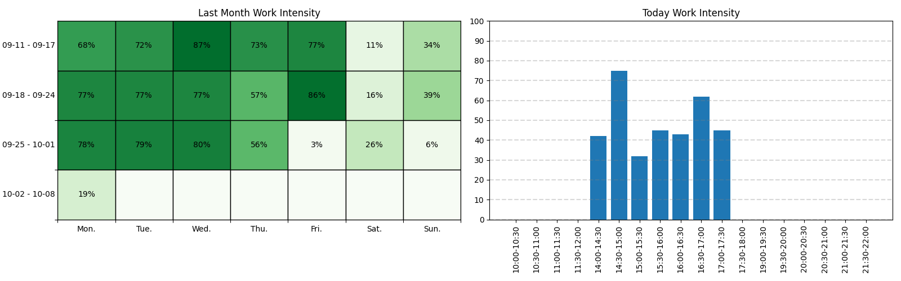

# Work Intensity

## 运行方法（仅可用于 macOS）

```bash
pip3 install rumps pynput pygetwindow matplotlib

python3 main.py &
```

## 图表解释



左图反映了过去一个月内每天的活跃度，颜色越深活跃度越高，右图反映了当天每半小时的活跃度（已经剔除了非工作时间的活跃度）。

每 30 分钟会计算一个活跃度，计算方式如下：

* 将 30 分钟 分成 100 块（每块 18 秒），如果在 18 秒内动过鼠标或者键盘，则认为用户在这一块时间内是活跃的，100 块时间中有 n 块是活跃的，则认为活跃度是 n%
* 全天活跃度 = 当天活跃的时间块数 / 18。这里在计算全天活跃度的时候没有除以 48（24 x 2），而是使用了工作时间的 9 小时
