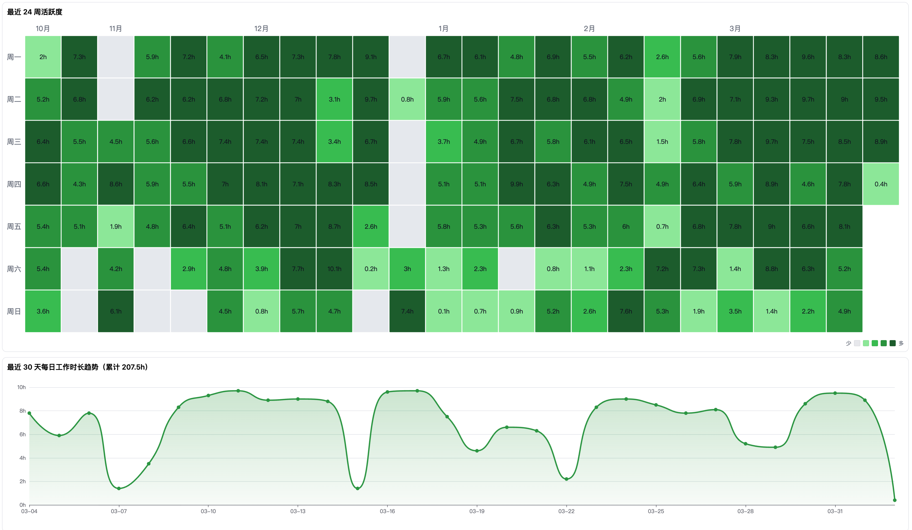

# Work Intensity

## 运行方法（仅可用于 macOS）

```bash
pip3 install rumps pynput pygetwindow

python3 main.py
```

## 图表解释



上半部分用热力图展示最近若干周内每天的「工作时长」（单位：小时），下半部分展示最近 30 天的每日工作时长趋势曲线。

## 每日工作时间计算方式

「每日工作时间」是基于输入事件（鼠标/键盘）与会议检测日志，对「活跃时长」的估算：

* 将一天按小时划分为 24 个统计周期（每小时一个）
* 每个小时再切成 100 个小时间块（每块 36 秒）
* 只要某个 36 秒时间块内出现过一次鼠标/键盘事件（或会议检测事件），就认为该时间块“活跃”
* 该小时的活跃时长 = 活跃块数 / 100（单位：小时）
* 当天工作时间（小时）= 24 个小时的活跃时长求和

## 数据存储与 iCloud 备份

程序使用 SQLite 存储活动数据，本地数据库文件位于 `log/work_intensity.sqlite3`。

* 如果开启了 iCloud Drive，会自动备份到 `~/Library/Mobile Documents/com~apple~CloudDocs/WorkIntensity/work_intensity.sqlite3`
* 当本地数据库缺失且 iCloud 备份存在时，程序会自动从 iCloud 恢复
